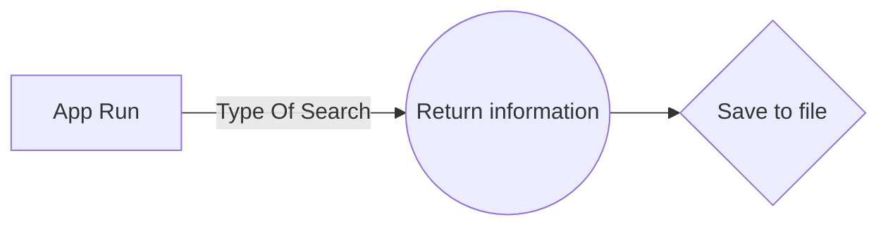

# Welcome to the NodeJS OMDB App!

Hi there media binger! Thank you for using the **NodeJS OMDB APP**. This app utilises absolutely **no** dependencies at all . The app requires either an [IMDb](https://www.imdb.com/) id code or a normal query search string.

# Usage

Quick rundown of how to use the app

## API Key

This app utilises a free API key from [OMDb](http://www.omdbapi.com/). An API key is provided already however it can be changed in *app.js* by changing the *apiKey* variable.

## Search Type

Switching between  IMDb ID and query search string is easy , simply alter the *typeOfSearch* variable to either *i* for id search or *t* for query string search.

## Run the file

Use the **node app.js** command.

## File

The received information from the API is stored in a *txt* file named *OMDBInfo* .

## App Flow

